**Supervisor:** Prof. Garg  
**Type:** Academic Project (Data Science, Machine Learning)

## Overview
This project, led by Prof. Garg, aimed to explore the quality of red wine using data science techniques. The objective was to analyze the physicochemical properties of red wine and to determine the best indicators of quality using Regression and Classification Models.

## Methodology
The methodology included:
1. **Exploratory Data Analysis (EDA):** Conducting an initial analysis to understand the dataset and identify potential relationships.
2. **Data Preparation:** Addressing missing values, handling outliers, and implementing feature scaling.
3. **Regression Model Implementation:** Employing Random Forest and Gradient Boosting models to predict wine quality.
4. **Classification Model Development:** Utilizing a Neural Network using TensorFlow and Keras for quality classification.

## Evaluation
The evaluation of the models involved:
- **Regression Model Assessment:** Using metrics like R-squared, RMSE, and MAE for performance evaluation.
- **Classification Model Analysis:** Tracking training and validation loss and accuracy, along with Precision, Recall, and Accuracy metrics.

## Key Findings
- Identified key physicochemical properties that significantly influence wine quality.
- Random Forest and Gradient Boosting models provided insights into the wine quality, with Random Forest showing slightly better performance.
- The Neural Network model demonstrated a promising ability to classify wine quality, though constrained by the dataset size.

## Personal Contributions
- **Complete Project Leadership:** Oversaw all aspects of the project from data collection to model development and evaluation.
- **Data Analysis and Preprocessing:** Conducted thorough EDA, data cleaning, and preparation for modeling.
- **Model Development and Optimization:** Developed both regression and classification models, focusing on fine-tuning and optimization.
- **Performance Evaluation:** Assessed the models using various metrics and interpreted the results to draw meaningful conclusions.

## Conclusion
This project showcased the effectiveness of data science techniques in analyzing and predicting red wine quality. The use of advanced modeling approaches provided valuable insights into the factors influencing wine quality and demonstrated the potential of machine learning in the food and beverage industry.

## Project Jupyter Notebook
Project's jupyter notebook can be viewed via this <a href="https://github.com/razaviah/Exploring-Red-Wine-Quality-Through-Data-Science/blob/main/Exploring-Red-Wine-Quality-Through-Data-Science.ipynb" target="_blank">link</a>

Or, you can view the text representation of it as follows:

<details>
  <summary>Click to expand!</summary>

  ## Exploring Red Wine Quality Through Data Science

  

  You can read more about the Data Science Methodology from this [IBM whitepaper](https://tdwi.org/~/media/64511A895D86457E964174EDC5C4C7B1.PDF) by John Rollins

  [Link](https://archive.ics.uci.edu/ml/datasets/wine+quality) for the dataset for context

  

  ### Business Understanding

  The red wine industry shows a recent exponential growth as social drinking is on the rise. Nowadays, industry players are using product quality certifications to promote their products. This is a time-consuming process and requires the assessment given by human experts, which makes this process very expensive. Also, the price of red wine depends on a rather abstract concept of wine appreciation by wine tasters, opinion among whom may have a high degree of variability. Another vital factor in red wine certification and quality assessment is physicochemical tests, which are laboratory-based and consider factors like acidity, pH level, sugar, and other chemical properties. The red wine market would be of interest if the human quality of tasting can be related to wine’s chemical properties so that certification and quality assessment and assurance processes are more controlled. 

  The goal is to implement Regression Models and Classification Models on the Red Wine Quality Dataset to determine which features are the best quality red wine indicators and generate insights into each of these factors to our model’s red wine quality.

  ### Analytic Approach
  Based on the above business understanding one should decide the analytical approach to follow. The approaches can be of 4 types: Descriptive approach (current status and information provided), Diagnostic approach(a.k.a statistical analysis, what is happening and why it is happening), Predictive approach(it forecasts on the trends or future events probability) and Prescriptive approach( how the problem should be solved actually).

  **Q1. What is the analytical approach that you would take for this project? Why do you think its the right approach?**

  *I would take Descriptive approach as we yet do not know what information are useful and have high impact on our wine quality. We are just presented with the raw data and descriptive approach would enable us to have an understanding of the potential relationships between variables and also helps us to present the data in a more meaningful way. After our analysis is finished, we would do the modellings.*

  ### Data Requirements

  **Q2. What kind of data do we require for predicting the red wine quality and for determining the features that are the best quality red wine indicators?**

  *We need a data which has many features like the physiochemical attributes (acidity, pH level, sugar, etc) so that we would have enough features to play around with to determine the features that are the best quality red wine indicators.*

  ### Data Collection

  **Q3. From where do we get our data?**

  *We get our data from Wine Quality Dataset which is gathered by:*

  - *Paulo Cortez, University of Minho, Guimarães, Portugal, http://www3.dsi.uminho.pt/pcortez*

  - *A. Cerdeira, F. Almeida, T. Matos and J. Reis, Viticulture Commission of the Vinho Verde Region(CVRVV), Porto, Portugal
  @2009*

  *and is accessible on UCI ML repository via this link https://archive.ics.uci.edu/ml/datasets/wine+quality*

  ### Data Understanding

  Link for the dataset https://archive.ics.uci.edu/ml/datasets/wine+quality for context

  **Q4. From where are red wine samples obtained?**

  *The red wine samples were obtained from the north of Portugal to model red wine quality based on physicochemical tests. The dataset is related to the red variant of Portuguese "Vinho Verde" wine.*

  **Q5. How can knowing the impact of each variable on the red wine quality help businesses(producers, distributors, etc) ?**

  *Knowing the impact of each variable would help businesses(producers, distributors, etc) better assess their production, distribution, and pricing strategy.*


  <li>Check the shape of data, and the datatypes of the features</li>
  <li>Understand the data by carrying out any steps that you think are necessary</li>


  ```python
  import matplotlib.pyplot as plt
  import joblib
  import pandas as pd
  import numpy as np
  import seaborn as sns
  import warnings
  from sklearn.preprocessing import normalize, StandardScaler
  warnings.filterwarnings("ignore", category=UserWarning)
  warnings.filterwarnings("ignore", category=FutureWarning)
  warnings.filterwarnings('ignore', category=DeprecationWarning)
  from sklearn.model_selection import train_test_split
  from sklearn import svm
  from sklearn.metrics import accuracy_score, precision_score, recall_score, classification_report
  from sklearn.model_selection import GridSearchCV

  wine = pd.read_csv("winequality-red.csv")
  wine.head()
  ```


  <div>
  <style scoped>
      .dataframe tbody tr th:only-of-type {
          vertical-align: middle;
      }

      .dataframe tbody tr th {
          vertical-align: top;
      }

      .dataframe thead th {
          text-align: right;
      }
  </style>
  <table border="1" class="dataframe">
    <thead>
      <tr style="text-align: right;">
        <th></th>
        <th>fixed acidity</th>
        <th>volatile acidity</th>
        <th>citric acid</th>
        <th>residual sugar</th>
        <th>chlorides</th>
        <th>free sulfur dioxide</th>
        <th>total sulfur dioxide</th>
        <th>density</th>
        <th>pH</th>
        <th>sulphates</th>
        <th>alcohol</th>
        <th>quality</th>
      </tr>
    </thead>
    <tbody>
      <tr>
        <th>0</th>
        <td>7.4</td>
        <td>0.70</td>
        <td>0.00</td>
        <td>1.9</td>
        <td>0.076</td>
        <td>11.0</td>
        <td>34.0</td>
        <td>0.9978</td>
        <td>3.51</td>
        <td>0.56</td>
        <td>9.4</td>
        <td>5</td>
      </tr>
      <tr>
        <th>1</th>
        <td>7.8</td>
        <td>0.88</td>
        <td>0.00</td>
        <td>2.6</td>
        <td>0.098</td>
        <td>25.0</td>
        <td>67.0</td>
        <td>0.9968</td>
        <td>3.20</td>
        <td>0.68</td>
        <td>9.8</td>
        <td>5</td>
      </tr>
      <tr>
        <th>2</th>
        <td>7.8</td>
        <td>0.76</td>
        <td>0.04</td>
        <td>2.3</td>
        <td>0.092</td>
        <td>15.0</td>
        <td>54.0</td>
        <td>0.9970</td>
        <td>3.26</td>
        <td>0.65</td>
        <td>9.8</td>
        <td>5</td>
      </tr>
      <tr>
        <th>3</th>
        <td>11.2</td>
        <td>0.28</td>
        <td>0.56</td>
        <td>1.9</td>
        <td>0.075</td>
        <td>17.0</td>
        <td>60.0</td>
        <td>0.9980</td>
        <td>3.16</td>
        <td>0.58</td>
        <td>9.8</td>
        <td>6</td>
      </tr>
      <tr>
        <th>4</th>
        <td>7.4</td>
        <td>0.70</td>
        <td>0.00</td>
        <td>1.9</td>
        <td>0.076</td>
        <td>11.0</td>
        <td>34.0</td>
        <td>0.9978</td>
        <td>3.51</td>
        <td>0.56</td>
        <td>9.4</td>
        <td>5</td>
      </tr>
    </tbody>
  </table>
  </div>


  ```python
  # The shape of data
  print('Number of samples: ', wine.shape[0])
  print('Number of features: ', wine.shape[1])

  ```

      Number of samples:  1599
      Number of features:  12


  ```python
  # The datatypes of the features
  wine.info()
  ```

      <class 'pandas.core.frame.DataFrame'>
      RangeIndex: 1599 entries, 0 to 1598
      Data columns (total 12 columns):
      #   Column                Non-Null Count  Dtype  
      ---  ------                --------------  -----  
      0   fixed acidity         1599 non-null   float64
      1   volatile acidity      1599 non-null   float64
      2   citric acid           1599 non-null   float64
      3   residual sugar        1599 non-null   float64
      4   chlorides             1599 non-null   float64
      5   free sulfur dioxide   1599 non-null   float64
      6   total sulfur dioxide  1599 non-null   float64
      7   density               1599 non-null   float64
      8   pH                    1599 non-null   float64
      9   sulphates             1599 non-null   float64
      10  alcohol               1599 non-null   float64
      11  quality               1599 non-null   int64  
      dtypes: float64(11), int64(1)
      memory usage: 150.0 KB


  From the below table, we can see that the data in our dataset is not distributed well and we have a lot more medium quality wines than the very high or low quality wines.


  ```python
  # understanding the data
  print(list(wine.columns))
  wine['quality'].value_counts()
  ```

      ['fixed acidity', 'volatile acidity', 'citric acid', 'residual sugar', 'chlorides', 'free sulfur dioxide', 'total sulfur dioxide', 'density', 'pH', 'sulphates', 'alcohol', 'quality']


      5    681
      6    638
      7    199
      4     53
      8     18
      3     10
      Name: quality, dtype: int64


  As we can see in the graphs below, generally, when there is low volatile acidity, chlorides, density, and pH, the quality of the wine is higher and with the increase in citric acid, sulphates, and alcohol the quality becomes higher. The residual sugar does not have much of a impact; as we can see in the graph of `residual sugar Vs. quality`, across different wine qualities, the residual sugar remains the same. The rest of the features have a mixture of behaviours regarding their impact on the quality.


  ```python
  for i, col in enumerate(list(wine.drop('quality', axis=1).columns)):
      plt.figure(i)
      sns.catplot(x='quality', y=col, data=wine, kind='point', aspect=2, )
  ```


      <Figure size 432x288 with 0 Axes>


      
  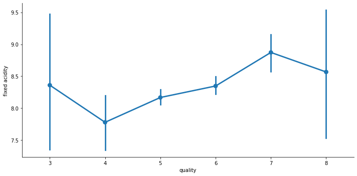
      


      
  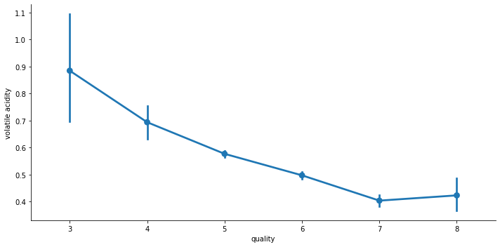
      


      
  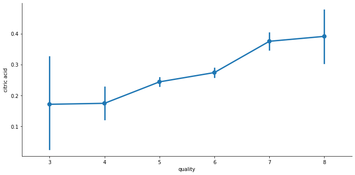
      


      
  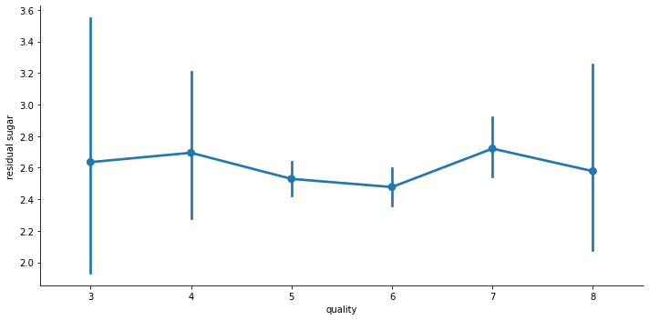
      


      
  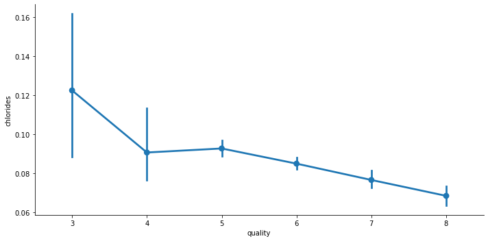
      


      
  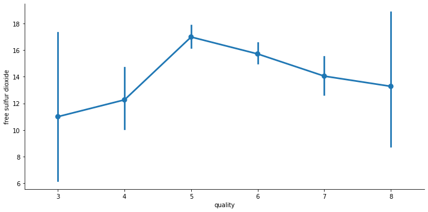
      


      
  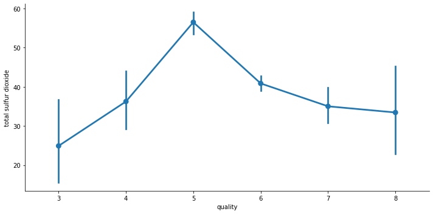
      


      
  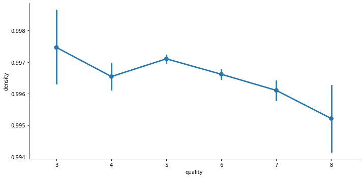
      


      
  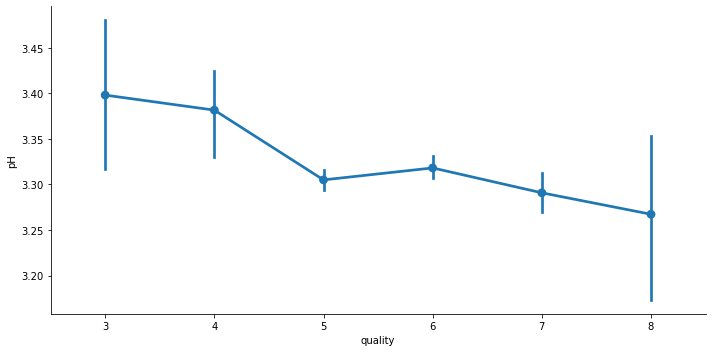
      


      
  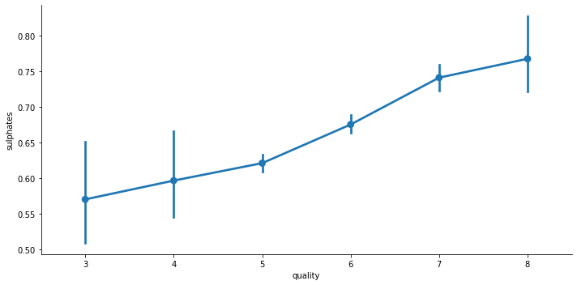
      


      
  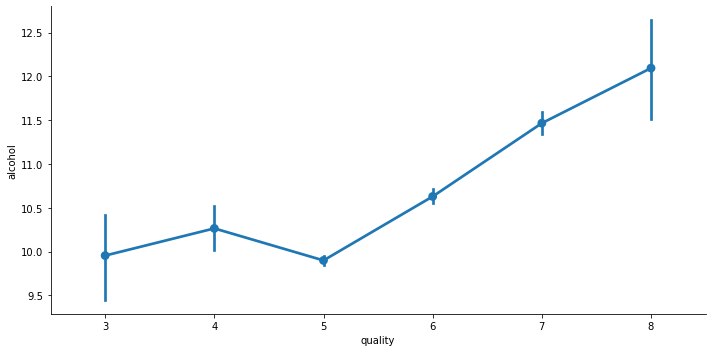
      


  ### Data Preparation

  #### Explore the dataset further
  *TODO*
  <li>Check for missing values and handle if any</li>
  <li>Check for outliers if any and handle them</li>
  <li>Implement Correlation heatmap</li>
  <li>Check the distribution of data using histograms</li>
  <li>Prepare the data for modeling by carrying out any steps that you think are necessary</li> (masalan feature scaling mitoonim anjam bedim ba standard scalar chon ke az plot e outlier ha mishe fahmid ke scale ashoon aslaaan yeki nist)

  There are no missing values in our dataset.


  ```python
  # Check for missing values and handle if any
  import missingno as msno

  msno.matrix(wine,figsize=(10,3))
  ```


      <AxesSubplot:>


      
  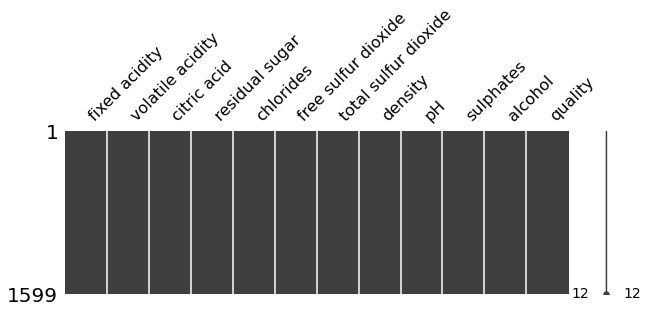
      


  There are obviously some outliers in our dataset which need to be handled. Also, from this graph we can see that the features are not on the same scale so we have class imbalance which we will need to handle using feature scaling.


  ```python
  # Check for outliers if any and handle them
  fig = plt.figure(figsize = (15,8))
  wine.drop(['quality'], axis=1).boxplot(grid=False)
  ```


      <AxesSubplot:>


      
  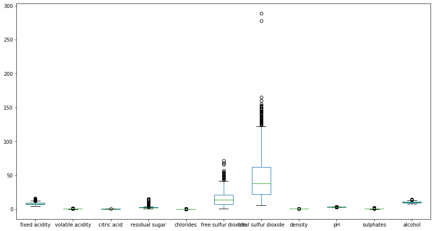
      


  As the number of outliers detected in total are more than 25% of our dataset, then not dropping them would be more reasonable. We will try to cap and floor the outliers by the 10th and 90th percentile.


  ```python
  # handling the outliers present

  df = wine.copy()

  Q1 = df.quantile(0.25)
  Q3 = df.quantile(0.75)
  IQR = Q3 - Q1

  # This part of the code is taken from StackOverflow
  df = df[~((df < (Q1 - 1.5 * IQR)) |(df > (Q3 + 1.5 * IQR))).any(axis=1)]

  print("Number of outliers detected %d" % (len(wine) - len(df)))
  print("Proportion of outliers to the whole dataset is %f" % ((len(wine) - len(df))/len(wine)))
  ```

      Number of outliers detected 420
      Proportion of outliers to the whole dataset is 0.262664


  ```python
  # handling the outliers present

  df = wine.copy()

  tenth_percentile = df.quantile(0.1)
  ninetieth_percentile = df.quantile(0.9)

  df = df.drop(['quality'], axis=1).clip(tenth_percentile, ninetieth_percentile, axis = 1)

  # savng the dataframe for future use
  df = df.assign(quality = wine['quality'])
  wineMod = df

  wineMod.head()
  ```


  <div>
  <style scoped>
      .dataframe tbody tr th:only-of-type {
          vertical-align: middle;
      }

      .dataframe tbody tr th {
          vertical-align: top;
      }

      .dataframe thead th {
          text-align: right;
      }
  </style>
  <table border="1" class="dataframe">
    <thead>
      <tr style="text-align: right;">
        <th></th>
        <th>fixed acidity</th>
        <th>volatile acidity</th>
        <th>citric acid</th>
        <th>residual sugar</th>
        <th>chlorides</th>
        <th>free sulfur dioxide</th>
        <th>total sulfur dioxide</th>
        <th>density</th>
        <th>pH</th>
        <th>sulphates</th>
        <th>alcohol</th>
        <th>quality</th>
      </tr>
    </thead>
    <tbody>
      <tr>
        <th>0</th>
        <td>7.4</td>
        <td>0.700</td>
        <td>0.010</td>
        <td>1.9</td>
        <td>0.076</td>
        <td>11.0</td>
        <td>34.0</td>
        <td>0.9978</td>
        <td>3.51</td>
        <td>0.56</td>
        <td>9.4</td>
        <td>5</td>
      </tr>
      <tr>
        <th>1</th>
        <td>7.8</td>
        <td>0.745</td>
        <td>0.010</td>
        <td>2.6</td>
        <td>0.098</td>
        <td>25.0</td>
        <td>67.0</td>
        <td>0.9968</td>
        <td>3.20</td>
        <td>0.68</td>
        <td>9.8</td>
        <td>5</td>
      </tr>
      <tr>
        <th>2</th>
        <td>7.8</td>
        <td>0.745</td>
        <td>0.040</td>
        <td>2.3</td>
        <td>0.092</td>
        <td>15.0</td>
        <td>54.0</td>
        <td>0.9970</td>
        <td>3.26</td>
        <td>0.65</td>
        <td>9.8</td>
        <td>5</td>
      </tr>
      <tr>
        <th>3</th>
        <td>10.7</td>
        <td>0.310</td>
        <td>0.522</td>
        <td>1.9</td>
        <td>0.075</td>
        <td>17.0</td>
        <td>60.0</td>
        <td>0.9980</td>
        <td>3.16</td>
        <td>0.58</td>
        <td>9.8</td>
        <td>6</td>
      </tr>
      <tr>
        <th>4</th>
        <td>7.4</td>
        <td>0.700</td>
        <td>0.010</td>
        <td>1.9</td>
        <td>0.076</td>
        <td>11.0</td>
        <td>34.0</td>
        <td>0.9978</td>
        <td>3.51</td>
        <td>0.56</td>
        <td>9.4</td>
        <td>5</td>
      </tr>
    </tbody>
  </table>
  </div>


  The correlation heatmap shows that there is no feature that is highly correlated (correlation > 0.5) with the `quality` of the wines.


  ```python
  # Implement Correlation heatmap

  corrMatt = wineMod.corr()
  mask = np.array(corrMatt)
  mask[np.tril_indices_from(mask)] = False
  fig,ax= plt.subplots()
  fig.set_size_inches(20,10)
  sns.heatmap(corrMatt, mask=mask,vmax=.8, square=True,annot=True)
  ```


      <AxesSubplot:>


      
  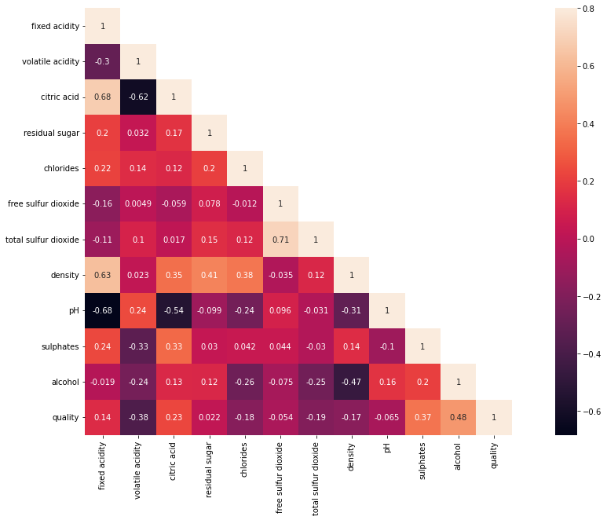
      


  In the below graphs, we can see the distribution of data which would help us have a basic understanding of effects of different features on the quality of the wine.


  ```python
  # Check the distribution of data using histograms

  sns.set_palette("dark")
  features = list(wineMod.drop(['quality'], axis = 1).columns.values)
  for i in features:
      quality3 = list(wineMod[wineMod['quality'] == 3][i].dropna())
      quality4 = list(wineMod[wineMod['quality'] == 4][i].dropna())
      quality5 = list(wineMod[wineMod['quality'] == 5][i].dropna())
      quality6 = list(wineMod[wineMod['quality'] == 6][i].dropna())
      quality7 = list(wineMod[wineMod['quality'] == 7][i].dropna())
      quality8 = list(wineMod[wineMod['quality'] == 8][i].dropna())
      xmin = min(min(quality3), min(quality4), min(quality5), min(quality6), min(quality7), min(quality8))
      xmax = max(max(quality3), max(quality4), max(quality5), max(quality6), max(quality7), max(quality8))
      width = (xmax - xmin) / 40
      sns.distplot(quality3, kde=False, bins=np.arange(xmin, xmax, width))
      sns.distplot(quality4, kde=False, bins=np.arange(xmin, xmax, width))
      sns.distplot(quality5, kde=False, bins=np.arange(xmin, xmax, width))
      sns.distplot(quality6, kde=False, bins=np.arange(xmin, xmax, width))
      sns.distplot(quality7, kde=False, bins=np.arange(xmin, xmax, width))
      sns.distplot(quality8, kde=False, bins=np.arange(xmin, xmax, width))
      plt.legend(['quality = 3', 'quality = 4', 'quality = 5', 'quality = 6', 'quality = 7', 'quality = 8'])
      plt.title('Overlaid histogram for {}'.format(i))
      plt.show()
  ```


      
  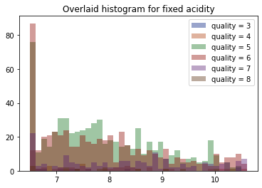
      


      
  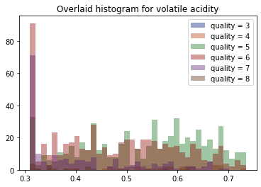
      


      
  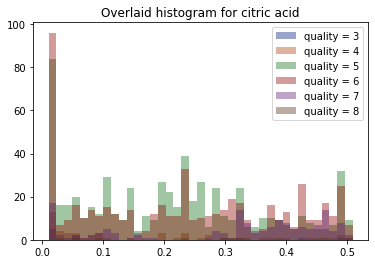
      


      
  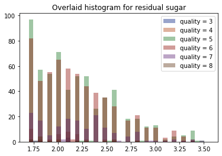
      


      
  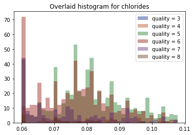
      


      
  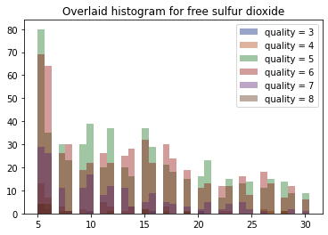
      


      
  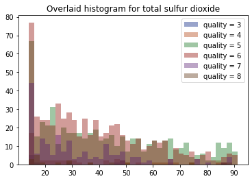
      


      
  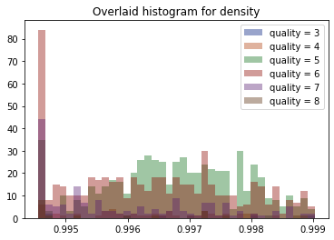
      


      
  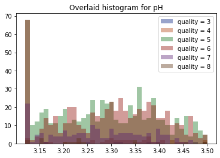
      


      
  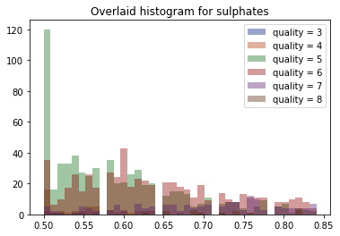
      


      
  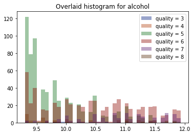
      


  As we have mentioned earlier, the features are not on the same scale and we have class imbalance in our dataset. To fix this issue, we implement feature scaling by standard scalar.


  ```python
  # Prepare the data for modeling by carrying out any steps that you think are necessary
  features = wineMod.drop('quality', axis=1)
  labels = wineMod['quality']

  # Creating Test and Train data
  X_train, X_test, y_train, y_test = train_test_split(features, labels, test_size=0.2, random_state=42)

  # implementing feature scaling
  scaler = StandardScaler()
  X_train = scaler.fit_transform(X_train)
  X_test = scaler.transform(X_test)
  ```

  ### Modeling

  <li>Implement Multivariable Linear Regression using any 2 Regression algorithms of your choice</li>
  <li>Implement a Neural Network using Tensorflow and Keras to classify wine quality</li>


  ```python
  # Implement Multivariable Linear Regression using any 2 Regression algorithms of your choice

  # First Multivariable Linear Regression (Random Forest)
  from sklearn.ensemble import RandomForestRegressor
  rfModel = RandomForestRegressor(n_estimators=500)
  rfModel.fit(X_train,y_train)
  rfPreds = rfModel.predict(X_test)


  # Second Multivariable Linear Regression Model (Gradient Boosting)
  # We used GridSearchCV to find the best hyperparameters but as the output was large, we just used the hyperparameters we got from our GridSearch
  from sklearn.ensemble import GradientBoostingRegressor

  # parametersGb = {
  #     "n_estimators":[5,50,250,500],
  #     "max_depth":[1,3,5,7,9],
  #     "learning_rate":[0.01,0.1,1,10,100]
  # }
  # gbGrid = GridSearchCV(GradientBoostingRegressor(), parametersGb, cv = 5)
  # gbModel = gbGrid.fit(X_train, y_train)

  gbModel = GradientBoostingRegressor(learning_rate=0.1, max_depth=3, n_estimators=250)
  gbModel.fit(X_train,y_train)
  gbPreds = gbModel.predict(X_test)
  ```


  ```python
  # Implement a Neural Network using Tensorflow and Keras to classify wine quality
  import tensorflow as tf
  tf.version.VERSION
  from tensorflow import keras
  from keras.models import Sequential
  from keras.layers import Dense, Flatten

  from tensorflow.keras.utils import to_categorical
  from tensorflow.keras.optimizers import SGD

  n_classes = 10
  y_train_nn = to_categorical(y_train, n_classes)
  y_test_nn = to_categorical(y_test, n_classes)

  nnModel = Sequential()
  nnModel.add(Dense(5, activation='relu', input_shape=(11,)))
  nnModel.add(Dense(10, activation='softmax'))
  ```


  ```python
  nnModel.summary()
  ```

      Model: "sequential"
      _________________________________________________________________
      Layer (type)                Output Shape              Param #   
      =================================================================
      dense (Dense)               (None, 5)                 60        
                                                                      
      dense_1 (Dense)             (None, 10)                60        
                                                                      
      =================================================================
      Total params: 120
      Trainable params: 120
      Non-trainable params: 0
      _________________________________________________________________


  ```python
  # Neural Network Model Configuration
  nnModel.compile(loss='categorical_crossentropy', optimizer='adam', metrics=['accuracy'])

  # Neural Network Model Training
  history = nnModel.fit(X_train, y_train_nn, batch_size=128, epochs=200, verbose=1, validation_data=(X_test, y_test_nn))
  ```

      Epoch 1/200
      10/10 [==============================] - 1s 31ms/step - loss: 2.7089 - accuracy: 0.0868 - val_loss: 2.6831 - val_accuracy: 0.0938
      Epoch 2/200
      10/10 [==============================] - 0s 7ms/step - loss: 2.6298 - accuracy: 0.1032 - val_loss: 2.6036 - val_accuracy: 0.1125
      Epoch 3/200
      10/10 [==============================] - 0s 6ms/step - loss: 2.5549 - accuracy: 0.1235 - val_loss: 2.5281 - val_accuracy: 0.1562
      Epoch 4/200
      10/10 [==============================] - 0s 5ms/step - loss: 2.4843 - accuracy: 0.1540 - val_loss: 2.4571 - val_accuracy: 0.1750
      Epoch 5/200
      10/10 [==============================] - 0s 6ms/step - loss: 2.4177 - accuracy: 0.1775 - val_loss: 2.3905 - val_accuracy: 0.1937
      Epoch 6/200
      10/10 [==============================] - 0s 5ms/step - loss: 2.3565 - accuracy: 0.2064 - val_loss: 2.3276 - val_accuracy: 0.2094
      Epoch 7/200
      10/10 [==============================] - 0s 5ms/step - loss: 2.2982 - accuracy: 0.2103 - val_loss: 2.2691 - val_accuracy: 0.2125
      Epoch 8/200
      10/10 [==============================] - 0s 5ms/step - loss: 2.2441 - accuracy: 0.2252 - val_loss: 2.2146 - val_accuracy: 0.2219
      Epoch 9/200
      10/10 [==============================] - 0s 6ms/step - loss: 2.1933 - accuracy: 0.2392 - val_loss: 2.1642 - val_accuracy: 0.2313
      Epoch 10/200
      10/10 [==============================] - 0s 5ms/step - loss: 2.1463 - accuracy: 0.2518 - val_loss: 2.1169 - val_accuracy: 0.2562
      Epoch 11/200
      10/10 [==============================] - 0s 5ms/step - loss: 2.1020 - accuracy: 0.2619 - val_loss: 2.0731 - val_accuracy: 0.2781
      Epoch 12/200
      10/10 [==============================] - 0s 5ms/step - loss: 2.0617 - accuracy: 0.2682 - val_loss: 2.0312 - val_accuracy: 0.2812
      Epoch 13/200
      10/10 [==============================] - 0s 6ms/step - loss: 2.0218 - accuracy: 0.2760 - val_loss: 1.9930 - val_accuracy: 0.2812
      Epoch 14/200
      10/10 [==============================] - 0s 5ms/step - loss: 1.9855 - accuracy: 0.2932 - val_loss: 1.9562 - val_accuracy: 0.3000
      Epoch 15/200
      10/10 [==============================] - 0s 5ms/step - loss: 1.9502 - accuracy: 0.3159 - val_loss: 1.9221 - val_accuracy: 0.3063
      Epoch 16/200
      10/10 [==============================] - 0s 6ms/step - loss: 1.9170 - accuracy: 0.3339 - val_loss: 1.8896 - val_accuracy: 0.3281
      Epoch 17/200
      10/10 [==============================] - 0s 5ms/step - loss: 1.8856 - accuracy: 0.3487 - val_loss: 1.8586 - val_accuracy: 0.3469
      Epoch 18/200
      10/10 [==============================] - 0s 6ms/step - loss: 1.8556 - accuracy: 0.3698 - val_loss: 1.8293 - val_accuracy: 0.3656
      Epoch 19/200
      10/10 [==============================] - 0s 5ms/step - loss: 1.8267 - accuracy: 0.3831 - val_loss: 1.8012 - val_accuracy: 0.3781
      Epoch 20/200
      10/10 [==============================] - 0s 5ms/step - loss: 1.7988 - accuracy: 0.3980 - val_loss: 1.7745 - val_accuracy: 0.3875
      Epoch 21/200
      10/10 [==============================] - 0s 5ms/step - loss: 1.7727 - accuracy: 0.4081 - val_loss: 1.7483 - val_accuracy: 0.4031
      Epoch 22/200
      10/10 [==============================] - 0s 5ms/step - loss: 1.7468 - accuracy: 0.4128 - val_loss: 1.7237 - val_accuracy: 0.4156
      Epoch 23/200
      10/10 [==============================] - 0s 6ms/step - loss: 1.7223 - accuracy: 0.4206 - val_loss: 1.6999 - val_accuracy: 0.4281
      Epoch 24/200
      10/10 [==============================] - 0s 5ms/step - loss: 1.6986 - accuracy: 0.4269 - val_loss: 1.6767 - val_accuracy: 0.4344
      Epoch 25/200
      10/10 [==============================] - 0s 5ms/step - loss: 1.6760 - accuracy: 0.4324 - val_loss: 1.6539 - val_accuracy: 0.4406
      Epoch 26/200
      10/10 [==============================] - 0s 6ms/step - loss: 1.6541 - accuracy: 0.4355 - val_loss: 1.6318 - val_accuracy: 0.4469
      Epoch 27/200
      10/10 [==============================] - 0s 6ms/step - loss: 1.6329 - accuracy: 0.4418 - val_loss: 1.6104 - val_accuracy: 0.4625
      Epoch 28/200
      10/10 [==============================] - 0s 5ms/step - loss: 1.6125 - accuracy: 0.4433 - val_loss: 1.5899 - val_accuracy: 0.4625
      Epoch 29/200
      10/10 [==============================] - 0s 5ms/step - loss: 1.5924 - accuracy: 0.4441 - val_loss: 1.5705 - val_accuracy: 0.4500
      Epoch 30/200
      10/10 [==============================] - 0s 5ms/step - loss: 1.5737 - accuracy: 0.4480 - val_loss: 1.5516 - val_accuracy: 0.4531
      Epoch 31/200
      10/10 [==============================] - 0s 6ms/step - loss: 1.5551 - accuracy: 0.4527 - val_loss: 1.5333 - val_accuracy: 0.4594
      Epoch 32/200
      10/10 [==============================] - 0s 5ms/step - loss: 1.5375 - accuracy: 0.4597 - val_loss: 1.5156 - val_accuracy: 0.4750
      Epoch 33/200
      10/10 [==============================] - 0s 6ms/step - loss: 1.5201 - accuracy: 0.4629 - val_loss: 1.4989 - val_accuracy: 0.4750
      Epoch 34/200
      10/10 [==============================] - 0s 6ms/step - loss: 1.5038 - accuracy: 0.4652 - val_loss: 1.4826 - val_accuracy: 0.4781
      Epoch 35/200
      10/10 [==============================] - 0s 5ms/step - loss: 1.4872 - accuracy: 0.4707 - val_loss: 1.4668 - val_accuracy: 0.4750
      Epoch 36/200
      10/10 [==============================] - 0s 5ms/step - loss: 1.4714 - accuracy: 0.4722 - val_loss: 1.4511 - val_accuracy: 0.4781
      Epoch 37/200
      10/10 [==============================] - 0s 5ms/step - loss: 1.4558 - accuracy: 0.4801 - val_loss: 1.4351 - val_accuracy: 0.4938
      Epoch 38/200
      10/10 [==============================] - 0s 5ms/step - loss: 1.4400 - accuracy: 0.4855 - val_loss: 1.4198 - val_accuracy: 0.4938
      Epoch 39/200
      10/10 [==============================] - 0s 5ms/step - loss: 1.4243 - accuracy: 0.4902 - val_loss: 1.4049 - val_accuracy: 0.5031
      Epoch 40/200
      10/10 [==============================] - 0s 5ms/step - loss: 1.4094 - accuracy: 0.4934 - val_loss: 1.3901 - val_accuracy: 0.5031
      Epoch 41/200
      10/10 [==============================] - 0s 5ms/step - loss: 1.3939 - accuracy: 0.4980 - val_loss: 1.3760 - val_accuracy: 0.5094
      Epoch 42/200
      10/10 [==============================] - 0s 5ms/step - loss: 1.3795 - accuracy: 0.4988 - val_loss: 1.3620 - val_accuracy: 0.5125
      Epoch 43/200
      10/10 [==============================] - 0s 5ms/step - loss: 1.3648 - accuracy: 0.5082 - val_loss: 1.3487 - val_accuracy: 0.5281
      Epoch 44/200
      10/10 [==============================] - 0s 5ms/step - loss: 1.3510 - accuracy: 0.5106 - val_loss: 1.3358 - val_accuracy: 0.5250
      Epoch 45/200
      10/10 [==============================] - 0s 5ms/step - loss: 1.3374 - accuracy: 0.5168 - val_loss: 1.3231 - val_accuracy: 0.5281
      Epoch 46/200
      10/10 [==============================] - 0s 5ms/step - loss: 1.3244 - accuracy: 0.5223 - val_loss: 1.3108 - val_accuracy: 0.5250
      Epoch 47/200
      10/10 [==============================] - 0s 6ms/step - loss: 1.3120 - accuracy: 0.5223 - val_loss: 1.2989 - val_accuracy: 0.5281
      Epoch 48/200
      10/10 [==============================] - 0s 5ms/step - loss: 1.2999 - accuracy: 0.5262 - val_loss: 1.2877 - val_accuracy: 0.5250
      Epoch 49/200
      10/10 [==============================] - 0s 5ms/step - loss: 1.2889 - accuracy: 0.5285 - val_loss: 1.2767 - val_accuracy: 0.5250
      Epoch 50/200
      10/10 [==============================] - 0s 5ms/step - loss: 1.2776 - accuracy: 0.5285 - val_loss: 1.2659 - val_accuracy: 0.5312
      Epoch 51/200
      10/10 [==============================] - 0s 5ms/step - loss: 1.2664 - accuracy: 0.5309 - val_loss: 1.2560 - val_accuracy: 0.5375
      Epoch 52/200
      10/10 [==============================] - 0s 5ms/step - loss: 1.2564 - accuracy: 0.5364 - val_loss: 1.2460 - val_accuracy: 0.5375
      Epoch 53/200
      10/10 [==============================] - 0s 5ms/step - loss: 1.2459 - accuracy: 0.5395 - val_loss: 1.2367 - val_accuracy: 0.5469
      Epoch 54/200
      10/10 [==============================] - 0s 5ms/step - loss: 1.2362 - accuracy: 0.5395 - val_loss: 1.2278 - val_accuracy: 0.5406
      Epoch 55/200
      10/10 [==============================] - 0s 5ms/step - loss: 1.2270 - accuracy: 0.5410 - val_loss: 1.2191 - val_accuracy: 0.5406
      Epoch 56/200
      10/10 [==============================] - 0s 6ms/step - loss: 1.2176 - accuracy: 0.5442 - val_loss: 1.2108 - val_accuracy: 0.5406
      Epoch 57/200
      10/10 [==============================] - 0s 6ms/step - loss: 1.2089 - accuracy: 0.5465 - val_loss: 1.2028 - val_accuracy: 0.5406
      Epoch 58/200
      10/10 [==============================] - 0s 5ms/step - loss: 1.2001 - accuracy: 0.5450 - val_loss: 1.1953 - val_accuracy: 0.5375
      Epoch 59/200
      10/10 [==============================] - 0s 6ms/step - loss: 1.1919 - accuracy: 0.5442 - val_loss: 1.1878 - val_accuracy: 0.5375
      Epoch 60/200
      10/10 [==============================] - 0s 6ms/step - loss: 1.1840 - accuracy: 0.5481 - val_loss: 1.1808 - val_accuracy: 0.5375
      Epoch 61/200
      10/10 [==============================] - 0s 5ms/step - loss: 1.1763 - accuracy: 0.5504 - val_loss: 1.1738 - val_accuracy: 0.5406
      Epoch 62/200
      10/10 [==============================] - 0s 5ms/step - loss: 1.1689 - accuracy: 0.5559 - val_loss: 1.1669 - val_accuracy: 0.5500
      Epoch 63/200
      10/10 [==============================] - 0s 5ms/step - loss: 1.1618 - accuracy: 0.5582 - val_loss: 1.1602 - val_accuracy: 0.5531
      Epoch 64/200
      10/10 [==============================] - 0s 6ms/step - loss: 1.1548 - accuracy: 0.5629 - val_loss: 1.1540 - val_accuracy: 0.5531
      Epoch 65/200
      10/10 [==============================] - 0s 5ms/step - loss: 1.1479 - accuracy: 0.5653 - val_loss: 1.1480 - val_accuracy: 0.5531
      Epoch 66/200
      10/10 [==============================] - 0s 5ms/step - loss: 1.1412 - accuracy: 0.5684 - val_loss: 1.1425 - val_accuracy: 0.5594
      Epoch 67/200
      10/10 [==============================] - 0s 5ms/step - loss: 1.1350 - accuracy: 0.5715 - val_loss: 1.1372 - val_accuracy: 0.5625
      Epoch 68/200
      10/10 [==============================] - 0s 5ms/step - loss: 1.1289 - accuracy: 0.5739 - val_loss: 1.1321 - val_accuracy: 0.5625
      Epoch 69/200
      10/10 [==============================] - 0s 5ms/step - loss: 1.1230 - accuracy: 0.5754 - val_loss: 1.1271 - val_accuracy: 0.5656
      Epoch 70/200
      10/10 [==============================] - 0s 5ms/step - loss: 1.1174 - accuracy: 0.5794 - val_loss: 1.1224 - val_accuracy: 0.5656
      Epoch 71/200
      10/10 [==============================] - 0s 5ms/step - loss: 1.1119 - accuracy: 0.5809 - val_loss: 1.1183 - val_accuracy: 0.5719
      Epoch 72/200
      10/10 [==============================] - 0s 6ms/step - loss: 1.1067 - accuracy: 0.5825 - val_loss: 1.1144 - val_accuracy: 0.5688
      Epoch 73/200
      10/10 [==============================] - 0s 5ms/step - loss: 1.1018 - accuracy: 0.5817 - val_loss: 1.1106 - val_accuracy: 0.5719
      Epoch 74/200
      10/10 [==============================] - 0s 6ms/step - loss: 1.0972 - accuracy: 0.5817 - val_loss: 1.1069 - val_accuracy: 0.5750
      Epoch 75/200
      10/10 [==============================] - 0s 6ms/step - loss: 1.0929 - accuracy: 0.5825 - val_loss: 1.1035 - val_accuracy: 0.5656
      Epoch 76/200
      10/10 [==============================] - 0s 6ms/step - loss: 1.0884 - accuracy: 0.5825 - val_loss: 1.1001 - val_accuracy: 0.5625
      Epoch 77/200
      10/10 [==============================] - 0s 6ms/step - loss: 1.0843 - accuracy: 0.5833 - val_loss: 1.0969 - val_accuracy: 0.5594
      Epoch 78/200
      10/10 [==============================] - 0s 6ms/step - loss: 1.0805 - accuracy: 0.5825 - val_loss: 1.0939 - val_accuracy: 0.5594
      Epoch 79/200
      10/10 [==============================] - 0s 6ms/step - loss: 1.0766 - accuracy: 0.5817 - val_loss: 1.0909 - val_accuracy: 0.5562
      Epoch 80/200
      10/10 [==============================] - 0s 6ms/step - loss: 1.0730 - accuracy: 0.5872 - val_loss: 1.0880 - val_accuracy: 0.5562
      Epoch 81/200
      10/10 [==============================] - 0s 7ms/step - loss: 1.0693 - accuracy: 0.5864 - val_loss: 1.0850 - val_accuracy: 0.5625
      Epoch 82/200
      10/10 [==============================] - 0s 6ms/step - loss: 1.0660 - accuracy: 0.5817 - val_loss: 1.0820 - val_accuracy: 0.5625
      Epoch 83/200
      10/10 [==============================] - 0s 6ms/step - loss: 1.0626 - accuracy: 0.5833 - val_loss: 1.0790 - val_accuracy: 0.5656
      Epoch 84/200
      10/10 [==============================] - 0s 6ms/step - loss: 1.0594 - accuracy: 0.5848 - val_loss: 1.0760 - val_accuracy: 0.5719
      Epoch 85/200
      10/10 [==============================] - 0s 6ms/step - loss: 1.0562 - accuracy: 0.5903 - val_loss: 1.0728 - val_accuracy: 0.5750
      Epoch 86/200
      10/10 [==============================] - 0s 6ms/step - loss: 1.0530 - accuracy: 0.5911 - val_loss: 1.0701 - val_accuracy: 0.5781
      Epoch 87/200
      10/10 [==============================] - 0s 6ms/step - loss: 1.0504 - accuracy: 0.5934 - val_loss: 1.0672 - val_accuracy: 0.5781
      Epoch 88/200
      10/10 [==============================] - 0s 6ms/step - loss: 1.0473 - accuracy: 0.5950 - val_loss: 1.0645 - val_accuracy: 0.5781
      Epoch 89/200
      10/10 [==============================] - 0s 6ms/step - loss: 1.0446 - accuracy: 0.5973 - val_loss: 1.0617 - val_accuracy: 0.5750
      Epoch 90/200
      10/10 [==============================] - 0s 5ms/step - loss: 1.0420 - accuracy: 0.6005 - val_loss: 1.0590 - val_accuracy: 0.5750
      Epoch 91/200
      10/10 [==============================] - 0s 5ms/step - loss: 1.0393 - accuracy: 0.6013 - val_loss: 1.0565 - val_accuracy: 0.5813
      Epoch 92/200
      10/10 [==============================] - 0s 5ms/step - loss: 1.0367 - accuracy: 0.6028 - val_loss: 1.0541 - val_accuracy: 0.5781
      Epoch 93/200
      10/10 [==============================] - 0s 5ms/step - loss: 1.0344 - accuracy: 0.6020 - val_loss: 1.0518 - val_accuracy: 0.5750
      Epoch 94/200
      10/10 [==============================] - 0s 5ms/step - loss: 1.0319 - accuracy: 0.6013 - val_loss: 1.0495 - val_accuracy: 0.5750
      Epoch 95/200
      10/10 [==============================] - 0s 6ms/step - loss: 1.0295 - accuracy: 0.6013 - val_loss: 1.0474 - val_accuracy: 0.5719
      Epoch 96/200
      10/10 [==============================] - 0s 5ms/step - loss: 1.0274 - accuracy: 0.6028 - val_loss: 1.0453 - val_accuracy: 0.5719
      Epoch 97/200
      10/10 [==============================] - 0s 5ms/step - loss: 1.0254 - accuracy: 0.6036 - val_loss: 1.0430 - val_accuracy: 0.5719
      Epoch 98/200
      10/10 [==============================] - 0s 5ms/step - loss: 1.0232 - accuracy: 0.6036 - val_loss: 1.0411 - val_accuracy: 0.5719
      Epoch 99/200
      10/10 [==============================] - 0s 5ms/step - loss: 1.0212 - accuracy: 0.6020 - val_loss: 1.0392 - val_accuracy: 0.5656
      Epoch 100/200
      10/10 [==============================] - 0s 6ms/step - loss: 1.0194 - accuracy: 0.6036 - val_loss: 1.0371 - val_accuracy: 0.5625
      Epoch 101/200
      10/10 [==============================] - 0s 6ms/step - loss: 1.0174 - accuracy: 0.6052 - val_loss: 1.0352 - val_accuracy: 0.5625
      Epoch 102/200
      10/10 [==============================] - 0s 5ms/step - loss: 1.0156 - accuracy: 0.6052 - val_loss: 1.0334 - val_accuracy: 0.5594
      Epoch 103/200
      10/10 [==============================] - 0s 5ms/step - loss: 1.0137 - accuracy: 0.6067 - val_loss: 1.0316 - val_accuracy: 0.5625
      Epoch 104/200
      10/10 [==============================] - 0s 5ms/step - loss: 1.0119 - accuracy: 0.6067 - val_loss: 1.0299 - val_accuracy: 0.5656
      Epoch 105/200
      10/10 [==============================] - 0s 6ms/step - loss: 1.0102 - accuracy: 0.6083 - val_loss: 1.0280 - val_accuracy: 0.5656
      Epoch 106/200
      10/10 [==============================] - 0s 5ms/step - loss: 1.0085 - accuracy: 0.6075 - val_loss: 1.0261 - val_accuracy: 0.5656
      Epoch 107/200
      10/10 [==============================] - 0s 6ms/step - loss: 1.0067 - accuracy: 0.6067 - val_loss: 1.0244 - val_accuracy: 0.5688
      Epoch 108/200
      10/10 [==============================] - 0s 5ms/step - loss: 1.0049 - accuracy: 0.6059 - val_loss: 1.0228 - val_accuracy: 0.5750
      Epoch 109/200
      10/10 [==============================] - 0s 5ms/step - loss: 1.0032 - accuracy: 0.6052 - val_loss: 1.0212 - val_accuracy: 0.5781
      Epoch 110/200
      10/10 [==============================] - 0s 5ms/step - loss: 1.0017 - accuracy: 0.6059 - val_loss: 1.0194 - val_accuracy: 0.5750
      Epoch 111/200
      10/10 [==============================] - 0s 5ms/step - loss: 1.0001 - accuracy: 0.6075 - val_loss: 1.0178 - val_accuracy: 0.5750
      Epoch 112/200
      10/10 [==============================] - 0s 6ms/step - loss: 0.9986 - accuracy: 0.6083 - val_loss: 1.0165 - val_accuracy: 0.5750
      Epoch 113/200
      10/10 [==============================] - 0s 5ms/step - loss: 0.9970 - accuracy: 0.6106 - val_loss: 1.0150 - val_accuracy: 0.5781
      Epoch 114/200
      10/10 [==============================] - 0s 5ms/step - loss: 0.9955 - accuracy: 0.6106 - val_loss: 1.0135 - val_accuracy: 0.5813
      Epoch 115/200
      10/10 [==============================] - 0s 5ms/step - loss: 0.9940 - accuracy: 0.6099 - val_loss: 1.0119 - val_accuracy: 0.5813
      Epoch 116/200
      10/10 [==============================] - 0s 5ms/step - loss: 0.9925 - accuracy: 0.6099 - val_loss: 1.0104 - val_accuracy: 0.5781
      Epoch 117/200
      10/10 [==============================] - 0s 5ms/step - loss: 0.9911 - accuracy: 0.6075 - val_loss: 1.0088 - val_accuracy: 0.5781
      Epoch 118/200
      10/10 [==============================] - 0s 5ms/step - loss: 0.9897 - accuracy: 0.6083 - val_loss: 1.0072 - val_accuracy: 0.5781
      Epoch 119/200
      10/10 [==============================] - 0s 5ms/step - loss: 0.9883 - accuracy: 0.6067 - val_loss: 1.0058 - val_accuracy: 0.5719
      Epoch 120/200
      10/10 [==============================] - 0s 6ms/step - loss: 0.9869 - accuracy: 0.6067 - val_loss: 1.0043 - val_accuracy: 0.5719
      Epoch 121/200
      10/10 [==============================] - 0s 5ms/step - loss: 0.9854 - accuracy: 0.6067 - val_loss: 1.0030 - val_accuracy: 0.5719
      Epoch 122/200
      10/10 [==============================] - 0s 5ms/step - loss: 0.9841 - accuracy: 0.6075 - val_loss: 1.0018 - val_accuracy: 0.5719
      Epoch 123/200
      10/10 [==============================] - 0s 5ms/step - loss: 0.9827 - accuracy: 0.6052 - val_loss: 1.0005 - val_accuracy: 0.5719
      Epoch 124/200
      10/10 [==============================] - 0s 5ms/step - loss: 0.9815 - accuracy: 0.6044 - val_loss: 0.9992 - val_accuracy: 0.5688
      Epoch 125/200
      10/10 [==============================] - 0s 5ms/step - loss: 0.9802 - accuracy: 0.6028 - val_loss: 0.9978 - val_accuracy: 0.5656
      Epoch 126/200
      10/10 [==============================] - 0s 6ms/step - loss: 0.9791 - accuracy: 0.6028 - val_loss: 0.9964 - val_accuracy: 0.5625
      Epoch 127/200
      10/10 [==============================] - 0s 5ms/step - loss: 0.9778 - accuracy: 0.6020 - val_loss: 0.9953 - val_accuracy: 0.5656
      Epoch 128/200
      10/10 [==============================] - 0s 5ms/step - loss: 0.9767 - accuracy: 0.6013 - val_loss: 0.9940 - val_accuracy: 0.5656
      Epoch 129/200
      10/10 [==============================] - 0s 5ms/step - loss: 0.9756 - accuracy: 0.5997 - val_loss: 0.9927 - val_accuracy: 0.5688
      Epoch 130/200
      10/10 [==============================] - 0s 5ms/step - loss: 0.9743 - accuracy: 0.5997 - val_loss: 0.9914 - val_accuracy: 0.5688
      Epoch 131/200
      10/10 [==============================] - 0s 5ms/step - loss: 0.9734 - accuracy: 0.5997 - val_loss: 0.9901 - val_accuracy: 0.5688
      Epoch 132/200
      10/10 [==============================] - 0s 5ms/step - loss: 0.9723 - accuracy: 0.5981 - val_loss: 0.9889 - val_accuracy: 0.5688
      Epoch 133/200
      10/10 [==============================] - 0s 5ms/step - loss: 0.9712 - accuracy: 0.5973 - val_loss: 0.9876 - val_accuracy: 0.5719
      Epoch 134/200
      10/10 [==============================] - 0s 5ms/step - loss: 0.9702 - accuracy: 0.5973 - val_loss: 0.9865 - val_accuracy: 0.5688
      Epoch 135/200
      10/10 [==============================] - 0s 5ms/step - loss: 0.9691 - accuracy: 0.5973 - val_loss: 0.9854 - val_accuracy: 0.5719
      Epoch 136/200
      10/10 [==============================] - 0s 5ms/step - loss: 0.9682 - accuracy: 0.5981 - val_loss: 0.9843 - val_accuracy: 0.5719
      Epoch 137/200
      10/10 [==============================] - 0s 5ms/step - loss: 0.9672 - accuracy: 0.5973 - val_loss: 0.9833 - val_accuracy: 0.5688
      Epoch 138/200
      10/10 [==============================] - 0s 5ms/step - loss: 0.9662 - accuracy: 0.5973 - val_loss: 0.9821 - val_accuracy: 0.5719
      Epoch 139/200
      10/10 [==============================] - 0s 5ms/step - loss: 0.9654 - accuracy: 0.5966 - val_loss: 0.9809 - val_accuracy: 0.5813
      Epoch 140/200
      10/10 [==============================] - 0s 5ms/step - loss: 0.9644 - accuracy: 0.6005 - val_loss: 0.9799 - val_accuracy: 0.5813
      Epoch 141/200
      10/10 [==============================] - 0s 5ms/step - loss: 0.9635 - accuracy: 0.5989 - val_loss: 0.9790 - val_accuracy: 0.5781
      Epoch 142/200
      10/10 [==============================] - 0s 5ms/step - loss: 0.9627 - accuracy: 0.5958 - val_loss: 0.9777 - val_accuracy: 0.5750
      Epoch 143/200
      10/10 [==============================] - 0s 5ms/step - loss: 0.9618 - accuracy: 0.5942 - val_loss: 0.9764 - val_accuracy: 0.5719
      Epoch 144/200
      10/10 [==============================] - 0s 5ms/step - loss: 0.9610 - accuracy: 0.5934 - val_loss: 0.9754 - val_accuracy: 0.5781
      Epoch 145/200
      10/10 [==============================] - 0s 5ms/step - loss: 0.9601 - accuracy: 0.5950 - val_loss: 0.9745 - val_accuracy: 0.5813
      Epoch 146/200
      10/10 [==============================] - 0s 6ms/step - loss: 0.9594 - accuracy: 0.5942 - val_loss: 0.9734 - val_accuracy: 0.5813
      Epoch 147/200
      10/10 [==============================] - 0s 6ms/step - loss: 0.9586 - accuracy: 0.5934 - val_loss: 0.9724 - val_accuracy: 0.5781
      Epoch 148/200
      10/10 [==============================] - 0s 5ms/step - loss: 0.9578 - accuracy: 0.5934 - val_loss: 0.9715 - val_accuracy: 0.5781
      Epoch 149/200
      10/10 [==============================] - 0s 5ms/step - loss: 0.9572 - accuracy: 0.5934 - val_loss: 0.9705 - val_accuracy: 0.5781
      Epoch 150/200
      10/10 [==============================] - 0s 6ms/step - loss: 0.9564 - accuracy: 0.5950 - val_loss: 0.9696 - val_accuracy: 0.5781
      Epoch 151/200
      10/10 [==============================] - 0s 5ms/step - loss: 0.9557 - accuracy: 0.5942 - val_loss: 0.9689 - val_accuracy: 0.5781
      Epoch 152/200
      10/10 [==============================] - 0s 5ms/step - loss: 0.9549 - accuracy: 0.5942 - val_loss: 0.9679 - val_accuracy: 0.5750
      Epoch 153/200
      10/10 [==============================] - 0s 5ms/step - loss: 0.9542 - accuracy: 0.5958 - val_loss: 0.9671 - val_accuracy: 0.5750
      Epoch 154/200
      10/10 [==============================] - 0s 5ms/step - loss: 0.9535 - accuracy: 0.5950 - val_loss: 0.9662 - val_accuracy: 0.5719
      Epoch 155/200
      10/10 [==============================] - 0s 5ms/step - loss: 0.9529 - accuracy: 0.5934 - val_loss: 0.9654 - val_accuracy: 0.5750
      Epoch 156/200
      10/10 [==============================] - 0s 5ms/step - loss: 0.9522 - accuracy: 0.5927 - val_loss: 0.9645 - val_accuracy: 0.5719
      Epoch 157/200
      10/10 [==============================] - 0s 5ms/step - loss: 0.9516 - accuracy: 0.5942 - val_loss: 0.9638 - val_accuracy: 0.5750
      Epoch 158/200
      10/10 [==============================] - 0s 5ms/step - loss: 0.9509 - accuracy: 0.5919 - val_loss: 0.9630 - val_accuracy: 0.5750
      Epoch 159/200
      10/10 [==============================] - 0s 5ms/step - loss: 0.9502 - accuracy: 0.5895 - val_loss: 0.9621 - val_accuracy: 0.5750
      Epoch 160/200
      10/10 [==============================] - 0s 5ms/step - loss: 0.9496 - accuracy: 0.5903 - val_loss: 0.9612 - val_accuracy: 0.5719
      Epoch 161/200
      10/10 [==============================] - 0s 5ms/step - loss: 0.9489 - accuracy: 0.5903 - val_loss: 0.9604 - val_accuracy: 0.5719
      Epoch 162/200
      10/10 [==============================] - 0s 5ms/step - loss: 0.9483 - accuracy: 0.5934 - val_loss: 0.9596 - val_accuracy: 0.5750
      Epoch 163/200
      10/10 [==============================] - 0s 5ms/step - loss: 0.9478 - accuracy: 0.5950 - val_loss: 0.9588 - val_accuracy: 0.5781
      Epoch 164/200
      10/10 [==============================] - 0s 5ms/step - loss: 0.9471 - accuracy: 0.5958 - val_loss: 0.9580 - val_accuracy: 0.5781
      Epoch 165/200
      10/10 [==============================] - 0s 6ms/step - loss: 0.9464 - accuracy: 0.5966 - val_loss: 0.9571 - val_accuracy: 0.5781
      Epoch 166/200
      10/10 [==============================] - 0s 6ms/step - loss: 0.9459 - accuracy: 0.5958 - val_loss: 0.9564 - val_accuracy: 0.5781
      Epoch 167/200
      10/10 [==============================] - 0s 6ms/step - loss: 0.9454 - accuracy: 0.5958 - val_loss: 0.9556 - val_accuracy: 0.5781
      Epoch 168/200
      10/10 [==============================] - 0s 6ms/step - loss: 0.9450 - accuracy: 0.5942 - val_loss: 0.9549 - val_accuracy: 0.5781
      Epoch 169/200
      10/10 [==============================] - 0s 6ms/step - loss: 0.9444 - accuracy: 0.5942 - val_loss: 0.9542 - val_accuracy: 0.5813
      Epoch 170/200
      10/10 [==============================] - 0s 6ms/step - loss: 0.9439 - accuracy: 0.5966 - val_loss: 0.9535 - val_accuracy: 0.5844
      Epoch 171/200
      10/10 [==============================] - 0s 6ms/step - loss: 0.9434 - accuracy: 0.5950 - val_loss: 0.9530 - val_accuracy: 0.5844
      Epoch 172/200
      10/10 [==============================] - 0s 6ms/step - loss: 0.9428 - accuracy: 0.5942 - val_loss: 0.9522 - val_accuracy: 0.5844
      Epoch 173/200
      10/10 [==============================] - 0s 5ms/step - loss: 0.9424 - accuracy: 0.5942 - val_loss: 0.9514 - val_accuracy: 0.5844
      Epoch 174/200
      10/10 [==============================] - 0s 6ms/step - loss: 0.9417 - accuracy: 0.5927 - val_loss: 0.9507 - val_accuracy: 0.5844
      Epoch 175/200
      10/10 [==============================] - 0s 6ms/step - loss: 0.9413 - accuracy: 0.5927 - val_loss: 0.9498 - val_accuracy: 0.5938
      Epoch 176/200
      10/10 [==============================] - 0s 5ms/step - loss: 0.9409 - accuracy: 0.5942 - val_loss: 0.9491 - val_accuracy: 0.5875
      Epoch 177/200
      10/10 [==============================] - 0s 6ms/step - loss: 0.9403 - accuracy: 0.5927 - val_loss: 0.9486 - val_accuracy: 0.5938
      Epoch 178/200
      10/10 [==============================] - 0s 6ms/step - loss: 0.9399 - accuracy: 0.5934 - val_loss: 0.9480 - val_accuracy: 0.5969
      Epoch 179/200
      10/10 [==============================] - 0s 6ms/step - loss: 0.9394 - accuracy: 0.5934 - val_loss: 0.9473 - val_accuracy: 0.5938
      Epoch 180/200
      10/10 [==============================] - 0s 6ms/step - loss: 0.9390 - accuracy: 0.5942 - val_loss: 0.9469 - val_accuracy: 0.5969
      Epoch 181/200
      10/10 [==============================] - 0s 6ms/step - loss: 0.9386 - accuracy: 0.5942 - val_loss: 0.9463 - val_accuracy: 0.5906
      Epoch 182/200
      10/10 [==============================] - 0s 6ms/step - loss: 0.9381 - accuracy: 0.5966 - val_loss: 0.9457 - val_accuracy: 0.5969
      Epoch 183/200
      10/10 [==============================] - 0s 5ms/step - loss: 0.9377 - accuracy: 0.5966 - val_loss: 0.9451 - val_accuracy: 0.5938
      Epoch 184/200
      10/10 [==============================] - 0s 5ms/step - loss: 0.9374 - accuracy: 0.5958 - val_loss: 0.9448 - val_accuracy: 0.5906
      Epoch 185/200
      10/10 [==============================] - 0s 5ms/step - loss: 0.9368 - accuracy: 0.6005 - val_loss: 0.9442 - val_accuracy: 0.5938
      Epoch 186/200
      10/10 [==============================] - 0s 5ms/step - loss: 0.9364 - accuracy: 0.5981 - val_loss: 0.9434 - val_accuracy: 0.6000
      Epoch 187/200
      10/10 [==============================] - 0s 6ms/step - loss: 0.9358 - accuracy: 0.5973 - val_loss: 0.9429 - val_accuracy: 0.5969
      Epoch 188/200
      10/10 [==============================] - 0s 5ms/step - loss: 0.9354 - accuracy: 0.5981 - val_loss: 0.9422 - val_accuracy: 0.5938
      Epoch 189/200
      10/10 [==============================] - 0s 6ms/step - loss: 0.9350 - accuracy: 0.5981 - val_loss: 0.9415 - val_accuracy: 0.5969
      Epoch 190/200
      10/10 [==============================] - 0s 5ms/step - loss: 0.9346 - accuracy: 0.5981 - val_loss: 0.9412 - val_accuracy: 0.5969
      Epoch 191/200
      10/10 [==============================] - 0s 5ms/step - loss: 0.9342 - accuracy: 0.5989 - val_loss: 0.9407 - val_accuracy: 0.5969
      Epoch 192/200
      10/10 [==============================] - 0s 5ms/step - loss: 0.9336 - accuracy: 0.6013 - val_loss: 0.9399 - val_accuracy: 0.5969
      Epoch 193/200
      10/10 [==============================] - 0s 5ms/step - loss: 0.9332 - accuracy: 0.6020 - val_loss: 0.9395 - val_accuracy: 0.5969
      Epoch 194/200
      10/10 [==============================] - 0s 5ms/step - loss: 0.9329 - accuracy: 0.6005 - val_loss: 0.9390 - val_accuracy: 0.5969
      Epoch 195/200
      10/10 [==============================] - 0s 6ms/step - loss: 0.9325 - accuracy: 0.6020 - val_loss: 0.9383 - val_accuracy: 0.5969
      Epoch 196/200
      10/10 [==============================] - 0s 5ms/step - loss: 0.9321 - accuracy: 0.6020 - val_loss: 0.9378 - val_accuracy: 0.5938
      Epoch 197/200
      10/10 [==============================] - 0s 5ms/step - loss: 0.9318 - accuracy: 0.6013 - val_loss: 0.9371 - val_accuracy: 0.5938
      Epoch 198/200
      10/10 [==============================] - 0s 6ms/step - loss: 0.9311 - accuracy: 0.6036 - val_loss: 0.9367 - val_accuracy: 0.5938
      Epoch 199/200
      10/10 [==============================] - 0s 5ms/step - loss: 0.9309 - accuracy: 0.6044 - val_loss: 0.9359 - val_accuracy: 0.5938
      Epoch 200/200
      10/10 [==============================] - 0s 5ms/step - loss: 0.9304 - accuracy: 0.6052 - val_loss: 0.9355 - val_accuracy: 0.5938


  ### Model Evaluation

  Evaluating the model accuracy is an essential part of the process in creating machine learning models to describe how well the model is performing in its predictions. Evaluation metrics change according to the problem type. Here, we'll briefly learn how to check the accuracy of the regression model.

  The linear model (regression) can be a typical example of this type of problem, and the main characteristic of the regression problem is that the targets of a dataset contain the real numbers only. The errors represent how much the model is making mistakes in its prediction. The basic concept of accuracy evaluation is to compare the original target with the predicted one according to certain metrics.


  **Regression model evaluation metrics**

  The MAE, RMSE, and R-Squared metrics are mainly used to evaluate the prediction error rates and model performance in regression analysis.

  **MAE (Mean absolute error)** represents the difference between the original and predicted values extracted by averaged the absolute difference over the data set.

  **RMSE (Root Mean Squared Error)** is the error rate by the square root of MSE.

  **R-squared (Coefficient of determination)** represents the coefficient of how well the values fit compared to the original values. The value from 0 to 1 interpreted as percentages. The higher the value is, the better the model is.

  The above metrics can be expressed as following:
  

  Please find more information on how to implement them from this link: https://scikit-learn.org/stable/modules/classes.html#regression-metrics

  Find more about feature importances from here: https://machinelearningmastery.com/calculate-feature-importance-with-python/

  **Classification model evaluation metrics**

  

  **For Regression models**
  <li>Use three metrics: R-squared, RMSE, and MAE, to evaluate model prediction performance</li>
  <li>Compare these 3 metrics for the two models and analyze the performance</li>
  <li>Calculate the feature importance scores for the top features that help predicting wine quality and visualize them</li>

  **For Classification model**
  <li> Plot training loss and validation loss </li>
  <li> Plot training accuracy and validation accuracy </li>
  <li> Evaluate the classsification model using Precision, Recall and Accuracy metrics </li>

  #### Evaluation of Regression models

  The Random Forest model has better scores in all of the R^2, RMSE, and MAE than the Gradient Boosting model as it is shown below. Random Forest model has R^2 of 0.53 whereas the Gradient Boosting model's R^2 is 0.49 (the higher, the better). Random forest has RMSE and MAE of 0.56, and 0.42, respectively, whereas the Gradient Boosting model has RMSE and MAE of 0.58, and 0.45 (the lower, the better).


  ```python
  from sklearn.metrics import mean_absolute_error, r2_score, mean_squared_error
  from math import sqrt

  def r2(y_, y):
      return r2_score(y_, y)
  def rmse(y_, y):
      return sqrt(mean_squared_error(y_, y))
  def mae(y_, y):
      return mean_absolute_error(y_, y)

  print('Random Forest scores: R^2: {}, RMSE: {}, MAE: {}'.format(r2(y_test, rfPreds), rmse(y_test, rfPreds), mae(y_test, rfPreds)))
  print('Gradient Boosting scores: R^2: {}, RMSE: {}, MAE: {}'.format(r2(y_test, gbPreds), rmse(y_test, gbPreds), mae(y_test, gbPreds)))
  ```

      Random Forest scores: R^2: 0.5237219061850895, RMSE: 0.5578983106265872, MAE: 0.42939999999999995
      Gradient Boosting scores: R^2: 0.48972586316712086, RMSE: 0.5774661360701656, MAE: 0.4515129888215445


  As we can see from the below graphs, both of our regression models, had almost the same determination for features' importance. The highest feature importance is related to the `alcohol` feature which was predictable as the `alcohol` had the highest correlation with the wine's `quality`.


  ```python
  # Calculating feature importance
  from matplotlib import pyplot

  rfImportance = rfModel.feature_importances_
  gbImportance = gbModel.feature_importances_

  featuresNames = list(wineMod.columns)
  # summarize feature importance
  print("Random Forest Regression Feature Importance: ")
  for i,v in enumerate(rfImportance):
      print('Feature: %20s, Score: %.5f' % (featuresNames[i],v))

  print("\n\nGradient Boosting Regression Feature Importance: ")
  for i,v in enumerate(gbImportance):
      print('Feature: %20s, Score: %.5f' % (featuresNames[i],v))

  # plot feature importance
  print("\n\nRandom Forest Regression Feature Importance Plot: ")
  pyplot.figure(figsize=(20, 3))
  pyplot.bar(featuresNames[:-1], list(rfImportance))
  pyplot.show()

  print("\n\nGradient Boosting Regression Feature Importance Plot: ")
  pyplot.figure(figsize=(20, 3))
  pyplot.bar(featuresNames[:-1], list(gbImportance))
  pyplot.show()
  ```

      Random Forest Regression Feature Importance: 
      Feature:        fixed acidity, Score: 0.05458
      Feature:     volatile acidity, Score: 0.09749
      Feature:          citric acid, Score: 0.05529
      Feature:       residual sugar, Score: 0.04788
      Feature:            chlorides, Score: 0.06904
      Feature:  free sulfur dioxide, Score: 0.05178
      Feature: total sulfur dioxide, Score: 0.08317
      Feature:              density, Score: 0.05652
      Feature:                   pH, Score: 0.05768
      Feature:            sulphates, Score: 0.15882
      Feature:              alcohol, Score: 0.26774
      
      
      Gradient Boosting Regression Feature Importance: 
      Feature:        fixed acidity, Score: 0.06297
      Feature:     volatile acidity, Score: 0.10438
      Feature:          citric acid, Score: 0.04191
      Feature:       residual sugar, Score: 0.02639
      Feature:            chlorides, Score: 0.06071
      Feature:  free sulfur dioxide, Score: 0.03230
      Feature: total sulfur dioxide, Score: 0.08289
      Feature:              density, Score: 0.05654
      Feature:                   pH, Score: 0.05041
      Feature:            sulphates, Score: 0.17765
      Feature:              alcohol, Score: 0.30386
      
      
      Random Forest Regression Feature Importance Plot: 


      
  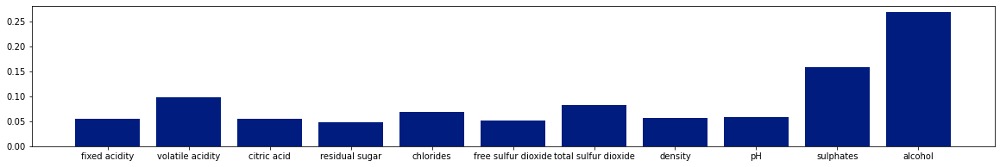
      


      
      
      Gradient Boosting Regression Feature Importance Plot: 


      
  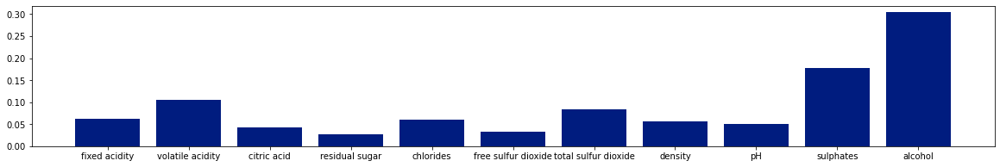
      


  #### Evaluation of Classification model

  As we can see from the below graphs, our Neural Network performs how it should perform meaning that our model did not overfit, or underfit the training data and we have almost the same accuracy scores for both of train and test sets. The training loss and test loss are the same too meaning that the model's loss would be around the same for the unseen data.


  ```python
  # Got this code from Stack Overflow
  plt.plot(history.history['accuracy'])
  plt.plot(history.history['val_accuracy'])
  plt.title('Training Accuracy Vs. Validation Accuracy')
  plt.ylabel('accuracy')
  plt.xlabel('epoch')
  plt.legend(['train', 'test'], loc='upper left')
  plt.show()

  plt.plot(history.history['loss'])
  plt.plot(history.history['val_loss'])
  plt.title('Training loss Vs. Validation loss')
  plt.ylabel('loss')
  plt.xlabel('epoch')
  plt.legend(['train', 'val'], loc='upper left')
  plt.show()
  ```


      
  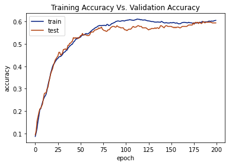
      


      
  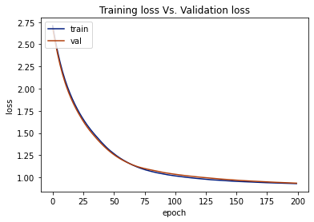
      


  The Neural Network model we have trained, has the scores of:
  - Accuracy: 0.59
  - Precision (weighted): 0.56
  - Recall (weighted): 0.59


  ```python
  y_predict = nnModel.predict(X_test)
  y_predict_num = np.argmax(y_predict, axis=1)

  # Got this code from https://machinelearningmastery.com/how-to-calculate-precision-recall-f1-and-more-for-deep-learning-models/
  # accuracy: (tp + tn) / (p + n)
  accuracy = accuracy_score(y_test, y_predict_num)
  print('Accuracy: %f' % accuracy)
  # precision tp / (tp + fp)
  precision = precision_score(y_test, y_predict_num, average='weighted')
  print('Precision: %f' % precision)
  # recall: tp / (tp + fn)
  recall = recall_score(y_test, y_predict_num, average='weighted')
  print('Recall: %f' % recall)
  ```

      Accuracy: 0.593750
      Precision: 0.559540
      Recall: 0.593750


  ### Conclusion

  The scores of our regression models:
  - Random Forest scores: 
    - R^2: 0.52
    - RMSE: 0.56
    - MAE: 0.43
  - Gradient Boosting scores: 
    - R^2: 0.49
    - RMSE: 0.58
    - MAE: 0.45


  The scores of our classification model (NN):
  - Accuracy: 0.59
  - Precision: 0.56
  - Recall: 0.59

  By comparing the performance scores, we can conclude that the Neural Network model performs much better than the other two regression models. Since the `wine quality` dataset contains lots of features and moderate correlations between many of the features, the relationships between different attributes of the dataset is hard to obtain and regression models are not good at finding complex relationships. But, the Neural Network models can be very useful to obtain these relationships as they are very good at very complex tasks. However, the Neural Network models need a very large amount of data which we do not have and due to that our classification model's performance scores were not as high as it could have been. 
</details>